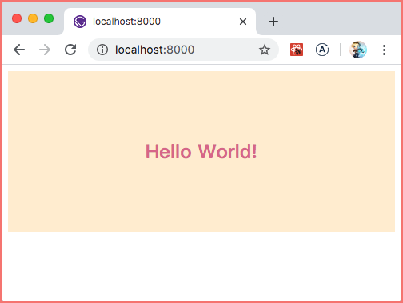
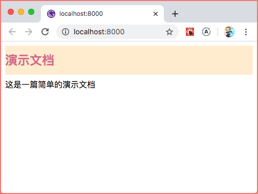

# Gatsby 入门

示例仓库https://github.com/XYShaoKang/gatsby-hello-world

查看[演示](https://xyshaokang.github.io/gatsby-getting-started/gatsby-hello-world/)

- [Gatsby 入门](#gatsby-入门)
  - [初始化项目](#初始化项目)
  - [支持 styled-components](#支持-styled-components)
  - [解析 Markdown 文件](#解析-markdown-文件)
  - [资源](#资源)

## 初始化项目

- 全局安装 Gatsby 命令行工具
- 使用 gatsby 初始化项目

初始化方式一:

```sh
# 安装全局命令行工具 gatsby,然后使用 gatsby 初始化项目
yarn global add gatsby-cli # or npm install -g gatsby-cli
gatsby new gatsby-hello-world https://github.com/gatsbyjs/gatsby-starter-hello-world
```

初始化方式二:

```sh
# 如果不想全局安装 gatsby,可以使用 npx
npx gatsby new gatsby-hello-world https://github.com/gatsbyjs/gatsby-starter-hello-world
```

进入项目,运行程序,在浏览器打开 http://localhost:8000/ 查看效果

```sh
cd gatsby-hello-world
yarn develop
```


> hello-world 比较简单,没有太多依赖,而官方的一些稍微复杂点的模板,一般都会带一个插件`gatsby-plugin-sharp`,很容易安装失败.如果安装失败,可以看看这个[临时解决方法](https://gist.github.com/XYShaoKang/ae657eb81279528cca718c678be28215)

初始化之后目录结构:

```sh
├── .cache # 运行缓存目录
├── node_modules # 保存安装的模块
├── public # 编译后文件的保存目录
├── src
│   └── pages # Gatsby 会将 pages 目录下的组件将解析为具有路径的页面
│       └── index.js
├── static
├── .gitignore
├── .prettierignore
├── .prettierrc
├── LICENSE
├── README.md
├── gatsby-config.js
├── package.json
└── yarn.lock
```

## 支持 styled-components

安装依赖

```sh
yarn add gatsby-plugin-styled-components styled-components babel-plugin-styled-components
```

配置`gatsby-config.js`

```js
module.exports = {
  plugins: [
    {
      resolve: `gatsby-plugin-styled-components`,
      options: {},
    },
  ],
}
```

使用`styled-components`,修改`src/pages/index.js`

```js
import React from 'react'
import styled from 'styled-components'

const Title = styled.h1`
  font-size: 1.5em;
  text-align: center;
  color: palevioletred;
`

const Wrapper = styled.section`
  padding: 4em;
  background: papayawhip;
`

export default () => (
  <Wrapper>
    <Title>Hello World!</Title>
  </Wrapper>
)
```

重启服务,运行查看效果



## 解析 Markdown 文件

1. 安装依赖

```sh
yarn add gatsby-source-filesystem gatsby-transformer-remark
```

2. 配置`gatsby-config.js`

```js
module.exports = {
  plugins: [
    {
      resolve: `gatsby-plugin-styled-components`,
      options: {},
    },
    {
      resolve: `gatsby-source-filesystem`,
      options: {
        name: `docs`,
        path: `${__dirname}/docs/`,
      },
    },
    {
      resolve: `gatsby-transformer-remark`,
      options: {},
    },
  ],
}
```

3. 添加演示文档用于测试,在项目根目录新建文件夹`docs`,在`docs`下新建`demo.md`,粘贴以下内容

```md
---
title: '演示文档'
---

这是一篇简单的演示文档
```

4. 修改`src/pages/index.js`用来渲染文档

```js
import React from 'react'
import styled from 'styled-components'

const Title = styled.h1`
  font-size: 1.5em;
  margin: 0;
  padding: 0.5em 0;
  color: palevioletred;
  background: papayawhip;
`

const Content = styled.div`
  margin-top: 0.5em;
`
export default ({ data }) => {
  const {
    frontmatter: { title },
    excerpt,
  } = data.allMarkdownRemark.edges[0].node
  return (
    <>
      <Title>{title}</Title>
      <Content>{excerpt}</Content>
    </>
  )
}

export const query = graphql`
  query {
    allMarkdownRemark {
      edges {
        node {
          frontmatter {
            title
          }
          excerpt
        }
      }
    }
  }
`
```

重启服务,查看效果



## 资源

- [hello-world](https://github.com/gatsbyjs/gatsby-starter-hello-world) 基础模板
- [styled-components](https://styled-components.com/) 设置 css
- [gatsby-plugin-styled-components](https://www.gatsbyjs.org/packages/gatsby-plugin-styled-components/) 在 Gatsby 中支持 styled-components 服务端渲染
- [gatsby-source-filesystem](https://www.gatsbyjs.org/packages/gatsby-source-filesystem/) 读取文件
- [gatsby-transformer-remark](https://www.gatsbyjs.org/packages/gatsby-transformer-remark/) 解析 Markdown
