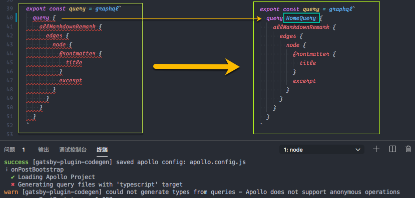

# 将 Gatsby 迁移到 TypeScript

- [将 Gatsby 迁移到 TypeScript](#将-gatsby-迁移到-typescript)
  - [初始化项目](#初始化项目)
  - [TS 配置](#ts-配置)
    - [安装`typescript`](#安装typescript)
    - [添加配置文件`tsconfig.json`](#添加配置文件tsconfigjson)
    - [补全 TS 声明定义](#补全-ts-声明定义)
  - [配置 ESLint 支持 TypeScript](#配置-eslint-支持-typescript)
  - [完善 GraphQL 类型提示](#完善-graphql-类型提示)
    - [安装`vscode-apollo`扩展](#安装vscode-apollo扩展)
    - [安装`gatsby-plugin-codegen`依赖](#安装gatsby-plugin-codegen依赖)
    - [配置`gatsby-config.js`](#配置gatsby-configjs)
    - [重新运行`Gatsby`生成类型文件](#重新运行gatsby生成类型文件)
    - [修改`index.tsx`以使用生成的类型](#修改indextsx以使用生成的类型)
    - [将自动生成的文件添加到`.gitignore`中](#将自动生成的文件添加到gitignore中)
  - [扩展阅读](#扩展阅读)

> 之前花了些时间将[`gatsby-theme-gitbook`](https://github.com/XYShaoKang/gatsby-theme-gitbook)迁移到 Typescript,以获得在 VSCode 中更好的编程体验.
>
> 整体差不多已经完成迁移,剩下将 Gatsby 的 API 文件也迁移到 TS,这里可以看到 [gatsby#21995](https://github.com/gatsbyjs/gatsby/issues/21995) 官方也在将核心代码库迁移到 Typescript,准备等待官方将核心代码库迁移完成,在迁移 API 文件.
>
> 这篇文章用[XYShaoKang/gatsby-project-config](https://github.com/XYShaoKang/gatsby-project-config),演示如何将 gatsby 迁移到 TypeScript,希望能帮到同样想要在 Gatsby 中使用 TS 的同学.

迁移步骤:

- TS 配置
- 配置 ESLint 支持 TS
- 使用`gatsby-plugin-codegen`完善 GraphQL 类型提示

## 初始化项目

```sh
gatsby new gatsby-migrate-to-typescript XYShaoKang/gatsby-project-config
cd gatsby-migrate-to-typescript
yarn develop
```

## TS 配置

- 安装`typescript`
- 添加`typescript.json`配置文件
- 修改 js 文件为 tsx
- 补全 TS 声明定义

### 安装`typescript`

```sh
yarn add -D typescript
```

### 添加配置文件`tsconfig.json`

```json
// https://www.typescriptlang.org/v2/docs/handbook/tsconfig-json.html
{
  "compilerOptions": {
    "target": "esnext", // 编译生成的目标 es 版本,可以根据需要设置
    "module": "commonjs", // 编译生成的目标模块系统
    "lib": ["dom", "es2015", "es2017"], // 配置需要包含的运行环境的类型定义
    "jsx": "react", // 配置 .tsx 文件的输出模式
    "strict": true, // 开启严格模式
    "esModuleInterop": true, // 兼容 CommonJS 和 ES Module
    "noUnusedLocals": true, // 报告未使用的局部变量的错误
    "noUnusedParameters": true, // 报告有关函数中未使用参数的错误
    "experimentalDecorators": true, // 启用装饰器
    "emitDecoratorMetadata": true, // 支持装饰器上生成元数据,用来进行反射之类的操作
    "noEmit": true, // 不输出 js,源映射或声明之类的文件,单纯用来检查错误
    "skipLibCheck": true // 跳过声明文件的类型检查,只会检查已引用的部分
  },
  "exclude": ["./node_modules", "./public", "./.cache"], // 解析时,应该跳过的路晋
  "include": ["src"] // 定义包含的路径,定义在其中的声明文件都会被解析进 vscode 的智能提示
}
```

将`index.js`改成`index.tsx`,重新启动服务,查看效果.

> 其实 Gatsby 内置了[支持 TS](https://github.com/gatsbyjs/gatsby/issues/18983),不用其他配置,只要把`index.js`改成`index.tsx`就可以直接运行.添加 TS 依赖是为了显示管理 TS,而`tsconfig.json`也是这个目的,当我们有需要新的特性以及自定义配置时,可以手动添加.

### 补全 TS 声明定义

打开`index.tsx`,VSCode 会报两个错误,一个是找不到`styled-components`的声明文件,这个可以通过安装`@types/styled-components`来解决.
另外一个错误`绑定元素“data”隐式具有“any”类型。`,这个错误是因为我们在`tsconfig.json`中指定了`"strict": true`,这会开启严格的类型检查,可以通过关闭这个选项来解决,只是我们用 TS 就是要用它的类型检查的,所以正确的做法是给`data`定义类型.
下面来一一修复错误.

安装`styled-components`的声明文件

```sh
yarn add -D @types/styled-components
```

修改`index.tsx`

```ts
import React, { FC } from 'react'

// ...

interface PageQuery {
  data: {
    allMarkdownRemark: {
      edges: Array<{
        node: {
          frontmatter: {
            title: string
          }
          excerpt: string
        }
      }>
    }
  }
}

const Home: FC<PageQuery> = ({ data }) => {
  const node = data.allMarkdownRemark.edges[0].node

  const title = node.frontmatter?.title
  const excerpt = node.excerpt

  return (
    <>
      <Title>{title}</Title>
      <Content>{excerpt}</Content>
    </>
  )
}

export default Home

// ...
```

这时候会出现一个新的错误,在`excerpt: string`处提示`Parsing error: Unexpected token`,这是因为 ESLint 还无法识别 TS 的语法,下面来配置 ESLint 支持 TS.

## 配置 ESLint 支持 TypeScript

安装依赖

```sh
yarn add -D @typescript-eslint/parser @typescript-eslint/eslint-plugin
```

配置`.eslintrc.js`

```js
module.exports = {
  parser: `@typescript-eslint/parser`, // 将解析器从`babel-eslint`替换成`@typescript-eslint/parser`,用以解析 TS 代码
  extends: [
    `google`,
    `eslint:recommended`,
    `plugin:@typescript-eslint/recommended`, // 使用 @typescript-eslint/eslint-plugin 推荐配置
    `plugin:react/recommended`,
    `prettier/@typescript-eslint`, // 禁用 @typescript-eslint/eslint-plugin 中与 prettier 冲突的规则
    `plugin:prettier/recommended`,
  ],
  plugins: [
    `@typescript-eslint`, // 处理 TS 语法规则
    `react`,
    `filenames`,
  ],
  // ...
}
```

在`.vscode/settings.json`中添加配置,让`VSCode`使用`ESLint`扩展格式化`ts`和`tsx`文件

```json
// .vscode/settings.json
{
  "eslint.format.enable": true,
  "[javascript]": {
    "editor.defaultFormatter": "dbaeumer.vscode-eslint"
  },
  "[javascriptreact]": {
    "editor.defaultFormatter": "dbaeumer.vscode-eslint"
  },
  "[typescript]": {
    "editor.defaultFormatter": "dbaeumer.vscode-eslint"
  },
  "[typescriptreact]": {
    "editor.defaultFormatter": "dbaeumer.vscode-eslint"
  }
}
```

## 完善 GraphQL 类型提示

```tsx
// index.tsx
// ...
interface PageQuery {
  data: {
    allMarkdownRemark: {
      edges: Array<{
        node: {
          frontmatter: {
            title: string
          }
          excerpt: string
        }
      }>
    }
  }
}

const Home: FC<PageQuery> = ({ data }) => {
  // ...
}

export default Home

export const query = graphql`
  query {
    allMarkdownRemark {
      edges {
        node {
          frontmatter {
            title
          }
          excerpt
        }
      }
    }
  }
`
```

我们看看`index.tsx`文件,会发现`PropTypes`和`query`结构非常类似,在`Gatsby`运行时,会把`query`查询的结果作为组件`prop.data`传入组件,而`PropTypes`是用来约束`prop`存在的.所以其实`PropTypes`就是根据`query`写出来的.

如果有依据`query`自动生成`PropTypes`的功能就太棒了.
另外一个问题是在`query`中编写`GraphQL`查询时,并没有类型约束,也没有智能提示.

这两个问题可以通过`gatsby-plugin-codegen`扩展来解决.
`gatsby-plugin-codegen`会生成`apollo.config.js`和`schema.json`,配合[`vscode-apollo`](https://marketplace.visualstudio.com/items?itemName=apollographql.vscode-apollo)扩展,可以提供`GraphQL`的类型约束和智能提示.
另外会自动根据`query`中的`GraphQL`查询,生成 TS 类型,放在对应的`tsx`文件同级目录下的`__generated__`文件夹,使用时只需要引入即可.

> 这里要注意,`Apollo`不支持匿名查询,需要使用命名查询
>
> 另外需要运行`Gatsby`之后才能通过`gatsby-plugin-codegen`生成类型文件

下面是具体操作

### 安装`vscode-apollo`扩展

在 VSCode 中按 `Ctrl + P` ( MAC 下: `Cmd + P`) 输入以下命令,按回车安装

```sh
ext install apollographql.vscode-apollo
```

### 安装`gatsby-plugin-codegen`依赖

在项目中添加依赖

```sh
yarn add gatsby-plugin-codegen
```

### 配置`gatsby-config.js`

```js
// gatsby-config.js
module.exports = {
  plugins: [
    // ...
    {
      resolve: `gatsby-plugin-codegen`,
      options: {},
    },
  ],
}
```

### 重新运行`Gatsby`生成类型文件

```sh
yarn develop
```

如果出现以下错误,一般是因为没有为查询命名的缘故,给查询添加命名即可,另外配置正确的话,打开对应的文件,有匿名查询,编辑器会有错误提示.



这个命名之后会作为生成的类型名.

### 修改`index.tsx`以使用生成的类型

`gatsby-plugin-codegen`插件会更具查询生成对应的查询名称的类型,保存在对应`tsx`文件同级的`__generated__`目录下.

```tsx
import { HomeQuery } from './__generated__/HomeQuery' // 引入自动生成的类型
// ...

// interface PageQuery {
//   data: {
//     allMarkdownRemark: {
//       edges: Array<{
//         node: {
//           frontmatter: {
//             title: string
//           }
//           excerpt: string
//         }
//       }>
//     }
//   }
// }

interface PageQuery {
  data: HomeQuery // 替换之前手写的类型
}

// ...
```

### 将自动生成的文件添加到`.gitignore`中

> `apollo.config.js`,`schema.json`,`__generated__`能通过运行时生成,所以可以添加到`.gitignore`中,不用提交到 git 中.当然如果有需要也可以选择提交到 git 中.

```
# Generated types by gatsby-plugin-codegen
__generated__
apollo.config.js
schema.json
```

## 扩展阅读

- 相关资料
  - [Gatsby Native TypeScript support](https://github.com/gatsbyjs/gatsby/issues/18983)
  - [Function Components](https://github.com/typescript-cheatsheets/react-typescript-cheatsheet#function-components)
  - [tsconfig.json](https://www.typescriptlang.org/v2/docs/handbook/tsconfig-json.html)
  - [typescript-eslint](https://github.com/typescript-eslint/typescript-eslint)
  - [gatsby-plugin-codegen](https://github.com/daugsbi/gatsby-plugin-codegen)
  - [Why the TypeScript team is using Gatsby for its new website](https://www.gatsbyjs.cn/blog/2020-01-23-why-typescript-chose-gatsby/)
- 类似教程
  - [INTRODUCTION: MIGRATING GATSBY SITE TO TYPESCRIPT](https://www.extensive.one/migrating-gatsby-to-typescript-introduction/)
